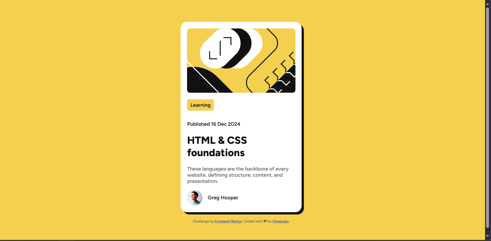

This is the solution to the [blog preview card challenge](https://www.frontendmentor.io/challenges/blog-preview-card-ckPaj01IcS)

In this challenge I've to build out this blog card component and get it looking as close to the design as possible.

And i've buit it like this:

# Built with

Built with
-Sementic HTML5 markup
-CSS
-flexbox
-css transition
-and, Style Componenets

# What I learned

- css transition
- css hover
- css box shadow
- :root property
- hand dirty on inspecting over the browser for overall look and feel of the interfacte and all.

# Useful Resources

I have found [MDN](https://developer.mozilla.org/en-US/) as best resource to go with it, highly helpful.

**Having fun in building!** 🚀
